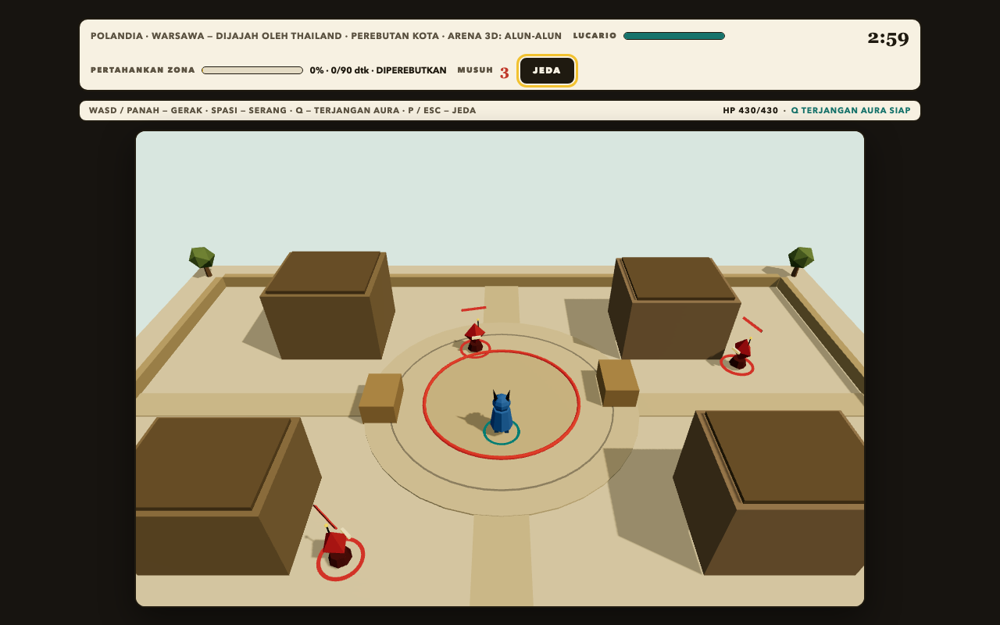
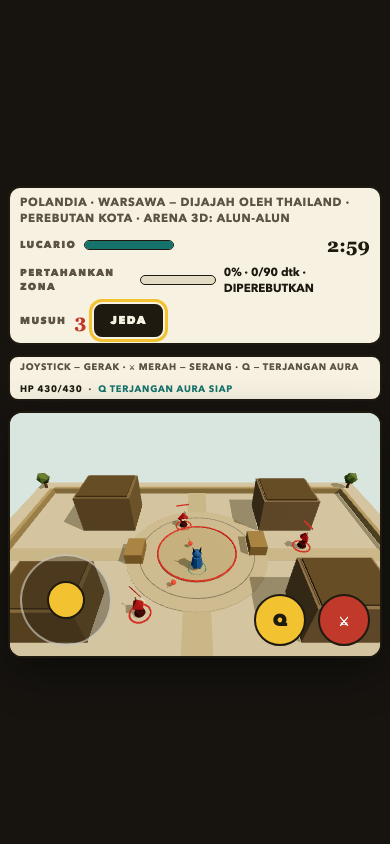

# Pokemon World War

Prototipe browser **fan-made dan tidak resmi** yang terinspirasi Pokemon Unite: satu kota, satu pertarungan, solo melawan AI di **arena 3D**. Tidak ada multiplayer daring, tidak ada afiliasi dengan Nintendo/The Pokemon Company — semua aset digambar/dibangun lokal.

## Menjalankan

```bash
npm run dev        # atau: node server.mjs
# buka http://127.0.0.1:5173
```

Butuh Node.js >= 22 dan browser dengan **WebGL2** (Chrome, Edge, Firefox, Safari modern dengan akselerasi perangkat keras aktif). Port bisa diganti: `PORT=8080 npm run dev`. Tanpa build step untuk menjalankan — ES module statis, cocok untuk GitHub Pages.

## Uji

```bash
npm test           # node --test — mesin + kolisi + model 3D + build
npm run verify     # uji lengkap + build dist/
```

## Deploy ke Cloudflare Workers (Static Assets)

`wrangler` adalah devDependency (butuh `npm ci`, Node >= 22):

```bash
npm run build        # salin 24 file allowlist -> dist/ (guard 25 MiB per file)
npm run deploy:check # wrangler deploy --dry-run: build hook lalu dry-run (tanpa auth)
npm run deploy       # wrangler deploy: build hook lalu deploy (butuh login Cloudflare)
```

Cloudflare Workers **Static Assets** menyajikan `dist/` apa adanya — tidak ada
server Node/HTTP di produksi, tidak ada fungsi Worker khusus. Build allowlist
(`scripts/build.mjs`) hanya menyalin file yang dibutuhkan game: JPG sumber referensi,
screenshot `docs/`, `test/`, `server.mjs`, dan konfigurasi tidak ikut ter-upload.
Batas 25 MiB per file dijaga di build.

`wrangler.jsonc` mendefinisikan **custom build hook** (`build.command` =
`npm run build`): setiap `wrangler deploy`/`wrangler dev` menjalankan build
allowlist dulu sehingga `dist/` selalu ada — termasuk di checkout segar yang
belum punya `dist/`. Artinya di dashboard Workers Builds, **Build command boleh
dikosongkan** dan Deploy command cukup `npx wrangler deploy` (atau isi eksplisit
`npm run build` — opsional, hasilnya sama); upload selalu `dist/`, tidak pernah
root repo. Root project = repo (tanpa `npm run server`). `compatibility_date`
di-pin ke `2026-09-04` agar kompatibel dengan toolchain Wrangler yang terpasang.
Pratinjau runtime lokal: `npx wrangler dev --local`. Readiness sudah diverifikasi
via `--dry-run`; perintah deploy produksi tidak dijalankan dalam verifikasi ini.

Troubleshooting: kegagalan pada fase *Initializing build environment* (build
berakhir sebelum clone/perintah apa pun berjalan) adalah timeout infrastruktur
platform, bukan masalah kode game — solusinya **Retry build** atau cek status
Cloudflare; tidak ada perubahan kode yang bisa memperbaikinya.

## Arena 3D — Alun-alun




Pertarungan berlangsung di satu level 3D low-poly bernama **Alun-alun**: alun-alun kota kecil dengan empat gedung kokoh, dua peti, cincin zona penaklukan, pagar pembatas, dan pepohonan di luar batas main — semua objek adalah mesh 3D nyata (tanpa sprite/billboard). Kamera perspektif mengikuti karakter dari sudut pandang taktis; pencahayaan matahari memproyeksikan bayangan nyata ke tanah.

Empat gedung dan dua peti adalah **dinding kokoh**: pemain dan proyektil tertahan, skill tidak menembus bangunan, dan musuh AI menavigasi memutari gedung dengan pathfinding grid.

> **Batasan saat ini:** hanya ada satu level bersama — pilihan negara/kota/peran masih memengaruhi metadata briefing, warna tim, dan narasi, tetapi geometri arena selalu "Alun-alun".

### Aset referensi pengguna

Ikon game (merek di header, favicon, dan apple-touch-icon) memakai gambar JPG
yang diberikan pengguna — sumber utuh di `assets/icons/game-icon-source.jpg`,
turunan PNG/ICO di `assets/icons/`.

### Pintasan Android (Samsung S10)

`manifest.json` di root memungkinkan pintasan layar utama ala aplikasi di
Chrome / Samsung Internet:

1. Buka URL game yang bisa dijangkau ponsel (lihat catatan di bawah).
2. Menu ⋮ → **Tambah ke Layar utama** / **Tambahkan halaman ke Layar utama**
   (label bervariasi antar-versi browser).
3. Konfirmasi nama **Pokemon WW** dan ikon — selesai.

> `http://127.0.0.1:5173` di PC **tidak bisa dibuka dari ponsel** (localhost
> milik PC). Untuk perilaku "installable" penuh, sajikan lewat hosting HTTPS
> yang bisa dijangkau ponsel — pintasan UI biasa tetap berfungsi meski tanpa
> itu. Tidak ada offline/service worker; ikon maskable disediakan untuk
> bentuk bundar/squircle Android. Tidak diverifikasi pada perangkat Samsung fisik.

Charizard dan Gengar memakai lembar referensi JPG yang diberikan pengguna —
[`assets/reference/charizard-sheet.jpg`](assets/reference/charizard-sheet.jpg) dan
[`assets/reference/gengar-sheet.jpg`](assets/reference/gengar-sheet.jpg) — untuk dua
hal: potret kartu seleksi (crop pose idle, `assets/characters/*-portrait.png`) dan
acuan visual model 3D prosedural di arena. **JPG tersebut bukan file model .glb** —
arena tetap memakai mesh segitiga prosedural (sayap Charizard dari ExtrudeGeometry,
seringai Gengar dari ExtrudeGeometry, dsb.), bukan sprite, billboard, atau tekstur gambar.

## Cara bermain

1. **Pilih karakter** — Pikachu (cepat, jarak jauh), Lucario (seimbang, jarak dekat), Charizard (kuat, jarak jauh), Gengar (licik, menyerap HP) — masing-masing model 3D berbeda.
2. **Medan perang** — pilih negara dan kota, tentukan peranmu *Bertahan* atau *Menyerang*, serta negara lawan (contoh: Polandia / Warsawa dijajah Thailand).
3. **Fase & waktu** — Infiltrasi (2 musuh), Perebutan kota (3 musuh), atau Pertahanan terakhir (4 musuh); durasi 1/3/5 menit.
4. Tekan **Mulai perang solo**.

**Aturan:** berdiri di dalam cincin zona pusat tanpa musuh di sekitarnya untuk mengisi kendali. Kendali penuh = menang langsung. Saat waktu habis, menang jika kendali >= 50% target. HP habis = kalah. Musuh yang jatuh muncul kembali setelah jeda, dibatasi jumlah fase.

## Kontrol

| Aksi | Keyboard | Sentuh |
| --- | --- | --- |
| Gerak | WASD / panah | Joystick kiri |
| Serangan dasar (bidik otomatis) | Spasi | Tombol merah |
| Skill unik | Q | Tombol kuning |
| Jeda / lanjut | P atau Esc | Tombol Jeda |

Strip kontrol di bawah HUD selalu menampilkan daftar kontrol aktif beserta nama skill,
HP numerik, dan hitung mundur cooldown skill. Di layar sentuh, joystick kiri menggerakkan
karakter; tombol merah menyerang, tombol kuning memakai skill.

## Struktur

- `server.mjs` — server statis Node bawaan (anti path-traversal, `PORT` bisa diatur).
- `js/data.js` — data karakter, negara/kota, fase.
- `js/level.js` — definisi level bersama: ukuran logis, skala dunia, 6 rintangan kokoh, zona.
- `js/collision.js` — kolisi lingkaran-vs-kotak, garis pandang (LOS), dan pathfinding grid.
- `js/models3d.js` — model low-poly prosedural untuk keempat Pokemon dan drone musuh.
- `js/game-engine.js` — simulasi murni (`createGame`, `stepGame`, `triggerAttack`, `triggerSkill`).
- `js/render.js` — renderer Three.js/WebGL2: scene, kamera follow, cahaya, bayangan, efek.
- `js/main.js` — UI setup, input, HUD, modal.
- `vendor/three/` — Three.js 0.180.0 (lihat `THIRD_PARTY.md`).
- `test/engine.test.mjs` + `test/collision.test.mjs` — uji mesin dan kolisi dengan RNG terinjeksi.
